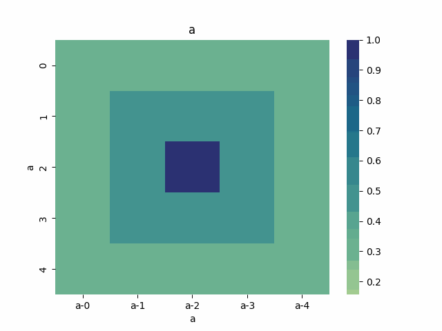

Epidemiology Use Cases
======================

.. _test use cases: https://github.com/ml4ai/funman/tree/main/test/test_use_cases.py

The following use cases reside in `test use cases`_.  The use cases listed under :ref:`Future Cases (below) <future-cases>` are use cases identified in previous versions that are work in progress.

Compare Bilayer Model to Simulator:
^^^^^^^^^^^^^^^^^^^^^^^^^^^^^^^^^^^

This use case involves the simulator and FUNMAN reasoning about the CHIME
SIR bilayer model.  See test `test_use_case_bilayer_consistency` in the `test use cases`_.

It first uses a SimulationScenario to execute the input simulator
function and evaluate the input query function using the simulation results.
In the example below this results in the run_CHIME_SIR simulator function and
evaluating whether or not the number of infected crosses the provided threshold with a custom QueryFunction referencing the `does_not_cross_threshold` function.

It then constructs an instance of the ConsistencyScenario class to evaluate whether a BilayerModel will satisfy the given query. The query asks whether the
number of infected at any time point exceeds a specified threshold.

Once each of these steps is executed the results are compared. The test will
succeed if the SimulatorScenario and ConsistencyScenario agree on the response to the query.

.. code-block:: py

    def compare_against_CHIME_Sim(
        self, bilayer_path, init_values, infected_threshold
    ):
        # query the simulator
        def does_not_cross_threshold(sim_results):
            i = sim_results[2]
            return all(i_t <= infected_threshold for i_t in i)

        query = QueryLE("I", infected_threshold)

        funman = Funman()

        sim_result: SimulationScenarioResult = funman.solve(
            SimulationScenario(
                model=SimulatorModel(run_CHIME_SIR),
                query=QueryFunction(does_not_cross_threshold),
            )
        )

        consistency_result: ConsistencyScenarioResult = funman.solve(
            ConsistencyScenario(
                model=BilayerModel(
                    BilayerDynamics.from_json(bilayer_path),
                    init_values=init_values,
                ),
                query=query,
            )
        )

        # assert the both queries returned the same result
        return sim_result.query_satisfied == consistency_result.query_satisfied

    def test_use_case_bilayer_consistency(self):
        """
        This test compares a BilayerModel against a SimulatorModel to
        determine whether their response to a query is identical.
        """
        bilayer_path = os.path.join(
            RESOURCES, "bilayer", "CHIME_SIR_dynamics_BiLayer.json"
        )
        infected_threshold = 130
        init_values = {"S": 9998, "I": 1, "R": 1}
        assert self.compare_against_CHIME_Sim(
            bilayer_path, init_values, infected_threshold
        )

Parameter Synthesis
-------------------

See tests `test_use_case_simple_parameter_synthesis` and `test_use_case_bilayer_parameter_synthesis` in the `test use cases`_.

The base set of types used during Parameter Synthesis include:

- a list of Parameters representing variables to be assigned
- a Model to be encoded as an SMTLib formula 
- a Scenario container representing a set of parameters and model
- a SearchConfig to configure search behavior
- the Funman interface that runs analysis using scenarios and configuration data

In the following example two parameters, x and y, are constructed. A model is 
also constructed that says 0.0 < x < 5.0 and 10.0 < y < 12.0. These parameters
and model are used to define a scenario that will use BoxSearch to synthesize
the parameters. The Funman interface and a search configuration are also 
defined. All that remains is to have Funman solve the scenario using the defined
configuration.

.. code-block:: py
    
    def test_use_case_simple_parameter_synthesis(self):
        x = Symbol("x", REAL)
        y = Symbol("y", REAL)

        formula = And(
            LE(x, Real(5.0)),
            GE(x, Real(0.0)),
            LE(y, Real(12.0)),
            GE(y, Real(10.0)),
        )

        funman = Funman()
        result: ParameterSynthesisScenarioResult = funman.solve(
            ParameterSynthesisScenario(
                [
                    Parameter(name="x", symbol=x),
                    Parameter(name="y", symbol=y),
                ],
                EncodedModel(formula),
            )
        )
        assert result

As an additional parameter synthesis example, the following test case demonstrates how to perform parameter synthesis for a bilayer model.  The configuration differs from the example above by introducing bilayer-specific constraints on the initial conditions (`init_values` assignments), parameter bounds (`parameter_bounds` intervals) and a model query.

.. code-block:: py

    def test_use_case_bilayer_parameter_synthesis(self):
        bilayer_path = os.path.join(
            RESOURCES, "bilayer", "CHIME_SIR_dynamics_BiLayer.json"
        )
        infected_threshold = 3
        init_values = {"S": 9998, "I": 1, "R": 1}

        lb = 0.000067 * (1 - 0.5)
        ub = 0.000067 * (1 + 0.5)

        funman = Funman()
        result: ParameterSynthesisScenarioResult = funman.solve(
            ParameterSynthesisScenario(
                parameters=[Parameter(name="beta", lb=lb, ub=ub)],
                model=BilayerModel(
                    BilayerDynamics.from_json(bilayer_path),
                    init_values=init_values,
                    parameter_bounds={
                        "beta": [lb, ub],
                        "gamma": [1.0 / 14.0, 1.0 / 14.0],
                    },
                ),
                query=QueryLE("I", infected_threshold),
            ),
            config=SearchConfig(tolerance=1e-8),
        )
        assert len(result.parameter_space.true_boxes) > 0 
        assert len(result.parameter_space.false_boxes) > 0 

.. _future-cases:

Future Cases
------------

Compare Translated FN to Simulator:
^^^^^^^^^^^^^^^^^^^^^^^^^^^^^^^^^^^

This use case involves the simulator and FUNMAN reasoning about the CHIME
SIR model.

It first runs the query_simulator function which executes the input simulator
function and evaluates the input query function using the simulation results.
In the example below this results in the run_CHIME_SIR simulator function and
evaluating whether or not the number of infected crosses the provided threshold.

It then constructs an instance of the QueryableGromet class using the provided
GroMEt file. This class constructs a model from the GroMEt file that can be
asked to answer a query with that model. In the example below the provided
GroMET file corresponds to the CHIME_SIR simulator. The query asks whether the
number of infected at any time point exceeds a specified threshold.

Once each of these steps is executed the results are compared. The test will
succeed if the simulator and QueryableGromet class agree on the response to the
query.

.. code-block::

    def compare_against_CHIME_FN(gromet_path, infected_threshold):
        # query the simulator
        def does_not_cross_threshold(sim_results):
            i = sim_results[2]
            return all(i_t <= infected_threshold for i_t in i)
        q_sim = does_not_cross_threshold(run_CHIME_SIR())

        # query the gromet file
        gromet = QueryableGromet.from_gromet_file(gromet_path)
        q_gromet = gromet.query(f"(forall ((t Int)) (<= (I t) {infected_threshold}))")

        # assert the both queries returned the same result
        return  q_sim == q_gromet

    # example call
    gromet = "CHIME_SIR_while_loop--Gromet-FN-auto.json"
    infected_threshold = 130
    assert compare_against_CHIME_FN(gromet, infected_threshold)

Compare Constant and Time-dependent Betas:
------------------------------------------

This use case involves two formulations of the CHIME model:
  - the original model where Beta is a epoch-dependent constant over three
    epochs (i.e., a triple of parameters)
  - a modified variant of the original model using a single constant Beta over
    the entire simulation (akin to a single epoch).

These two formulations of the CHIME model are read in from GroMEt files into
instances of the QueryableGromet class. These models are asked to synthesize a
parameter space based on a query. Note that this synthesis step is stubbed in
this example and a more representative example of parameter synthesis can be
found below. Once these parameter spaces are synthesized the example then
compares the models by determining that the respective spaces of feasible
parameter values intersect.

.. code-block::

    def test_parameter_synthesis():
    ############################ Prepare Models ####################################
    # read in the gromet files
    # GROMET_FILE_1 is the original GroMEt extracted from the simulator
    # It sets N_p = 3 and n_days = 20, resulting in three epochs of 0, 20, and 20 days
    gromet_org = QueryableGromet.from_gromet_file(GROMET_FILE_1)
    # GROMET_FILE_2 modifes sets N_p = 2 and n_days = 40, resulting in one epoch of 40 days
    gromet_sub = QueryableGromet.from_gromet_file(GROMET_FILE_2)
    # Scenario query threshold
    infected_threshold = 130

    ############################ Evaluate Models ###################################
    # some test query
    query f"(forall ((t Int)) (<= (I t) {infected_threshold}))"
    # get parameter space for the original (3 epochs)
    ps_b1_b2_b3 = gromet_org.synthesize_parameters(query)
    # get parameter space for the constant beta variant
    ps_bc = gromet_sub.synthesize_parameters(query)

    ############################ Compare Models ####################################
    # construct special parameter space where parameters are equal
    ps_eq = ParameterSpace.construct_all_equal(ps_b1_b2_b3)
    # intersect the original parameter space with the ps_eq to get the
    # valid parameter space where (b1 == b2 == b3)
    ps = ParameterSpace.intersect(ps_b1_b2_b3, ps_eq)
    # assert the parameters spaces for the original and the constant beta
    # variant are the same
    assert(ParameterSpace.compare(ps_bc, ps))

Compare Bi-Layer Model to Bi-Layer Simulator:
---------------------------------------------

This use case compares the simulator and FUNMAN reasoning about the CHIME
SIR model.

It first runs the query_simulator function which executes the input simulator
function and evaluates the input query function using the simulation results.
In the example below this results in the run_CHIME_SIR_BL simulator function and
evaluating whether or not the number of infected crosses the provided threshold.

It then constructs an instance of the QueryableBilayer class using the provided
bilayer file. This class constructs a model from the bilayer file that can be
asked to answer a query with that model. In the example below the provided
bilayer file corresponds to the CHIME_SIR simulator. The query asks whether the
number of infected at any time point exceeds a specified threshold.

Once each of these steps is executed the results are compared. The test will
succeed if the simulator and QueryableBilayer class agree on the response to the
query.

.. code-block::

    def compare_against_CHIME_bilayer(bilayer_file, infected_threshold):
        # query the simulator
        def does_not_cross_threshold(sim_results):
            i = sim_results[1]
            return (i <= infected_threshold)
        q_sim = does_not_cross_threshold(run_CHIME_SIR_BL())
        print("q_sim", q_sim)

        # query the bilayer file
        bilayer = QueryableBilayer.from_file(bilayer_file)
        q_bilayer = bilayer.query(f"(i <= infected_threshold)")
        print("q_bilayer", q_bilayer)

        # assert the both queries returned the same result
        return  q_sim == q_bilayer

    # example call
    bilayer_file = "CHIME_SIR_dynamics_BiLayer.json"
    infected_threshold = 130
    assert compare_against_CHIME_bilayer(bilayer_file, infected_threshold)

Climate Use Cases
======================

.. _pde as petri: https://github.com/ml4ai/funman/tree/main/notebooks/pde_as_petrinet.ipynb
.. _pde to petri translation: https://github.com/ml4ai/funman/tree/main/auxiliary_packages/pde2petri/doc/discretization/main.pdf
.. _advection: https://www.uni-muenster.de/imperia/md/content/physik_tp/lectures/ws2016-2017/num_methods_i/advection.pdf
.. _model representation: https://github.com/DARPA-ASKEM/Model-Representations/pull/77

We developed use cases for climate models by translating the climate models into petri nets.  The use cases involve both consistency and parameter synthesis problems.  The notebook `pde to petri`_ demonstrates scenarios for the Halfar ice dome and advection models.  The methodology for translating the PDE models into petri nets is described in the `pde to petri translation`_ documentation.

Identify Parameters for Halfar Ice Model
^^^^^^^^^^^^^^^^^^^^^^^^^^^^^^^^^^^^^^^^

We developed multiple formulations of the Halfar Ice dome model that used different differential expressions to compare alternative discretization strategies.  Each model uses a parameter A, which FUNMAN selects to ensure that the ice cap height at each discretized location remained non-negative.  We found that if given the range [1e-20, 1e-12] for the A parameter, FUNMAN is capable of finding a value for A that prevents the ice height from becoming negative.  We also found several differences between the difference methods used to discretize the PDE, namely that centered difference produces symmetric change in the ice dome, and backward and forward difference do not.

.. The centered difference:

.. .. image:: _static/halfar_centered_1D.gif

.. The forward difference:

.. .. image:: _static/halfar_forward_1D.gif

.. The backward difference:

.. .. image:: _static/halfar_backward_1D.gif
 
Compare Discretization Methods for PDEs with the Advection Model
^^^^^^^^^^^^^^^^^^^^^^^^^^^^^^^^^^^^^^^^^^^^^^^^^^^^^^^^^^^^^^^^

In the case of the Advection Equation, we are able to observe phenomena that is expected from the literature [`advection`_]. For example, for the equation ∂h/∂t + a * ∂h/∂x = 0 where a > 0, we expect different results depending on the choice of discretization.  Since both the solution and stability behavior is known, our next steps will be to validate FUNMAN’s parameter synthesis by comparing FUNMAN’s calculated valid parameter ranges for the advection equation to what is known in the literature in the forward, centered, and backward difference scheme cases.  FUNMAN was able discover how the forward difference scheme violates the non-negativity constraints we placed upon the model, and that the backward scheme does not.  

The following figure (gif) animates a time series computed by FUNMAN for the two dimensional advection equation where the boundary condition is zero for all locations and times.  The initial state models  a dome-like energy variable “a” over a 5x5 grid.  FUNMAN identifies a parameter value “u” that satisfies several constraints. The constraints are that “u” is in [0.5, 1], and that “a” is non-negative for all time steps and locations.  FUNMAN solves this problem with a petri net encoding of the discretized PDE, using a backward derivative for the spatial dimensions and a forward derivative for the temporal dimension.  The solution animated below assigns u = 0.5 and corresponds to a positive velocity that moves the energy in the positive direction in each dimension and diffusion.  The AMR for this instance is available through the ASKEM `model representation`_ repo. 

